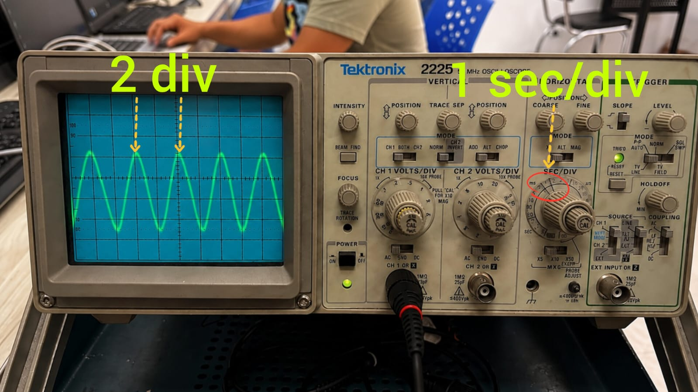
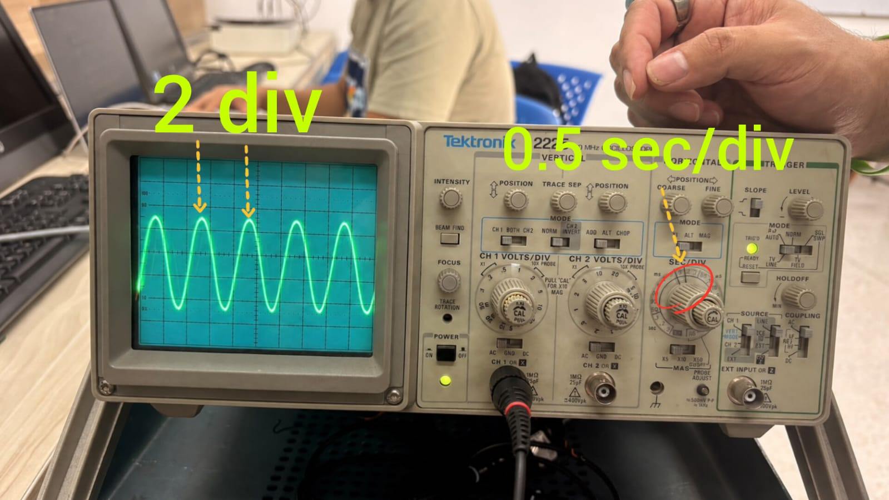
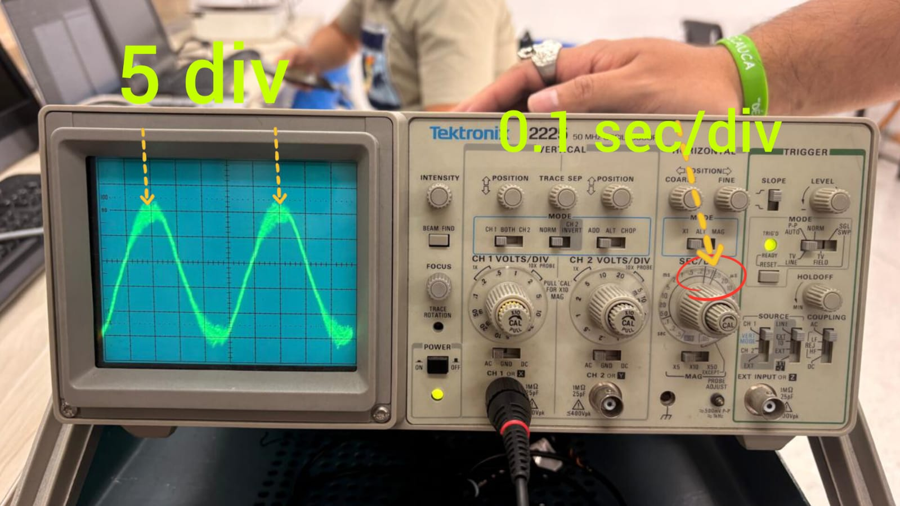
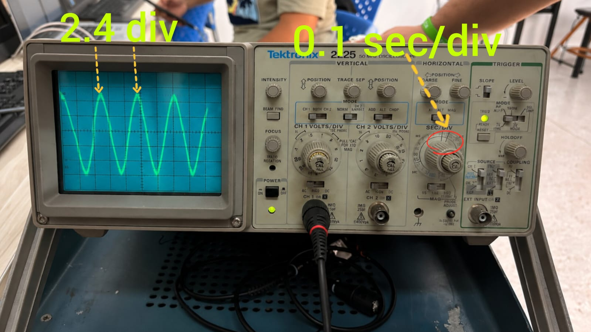

# ANEXO F. VALIDACIÓN DE EFECTIVIDAD TÉCNICA, PERTINENCIA Y EVALUACIÓN DEL DISPOSITIVO

---

## F.1 Validación técnica del módulo de estímulo sonoro

### F.1.1 Objetivo de la prueba

La prueba tuvo como objetivo verificar la correspondencia entre los parámetros configurados internamente en el módulo de estímulo sonoro del dispositivo y las características reales de la señal reproducida por el sistema de audio.

La evaluación se centró en la verificación de la reproducción de frecuencias configuradas y la consistencia del estímulo generado antes de su utilización durante los ensayos experimentales.

Esta prueba corresponde a una **verificación técnica del desempeño del hardware dentro del contexto experimental del dispositivo**, por lo cual sus resultados no deben interpretarse como una calibración audiológica clínica ni como una certificación de niveles de presión sonora. Su finalidad fue comprobar que el módulo reproduce estímulos consistentes y cercanos a los parámetros definidos en el protocolo experimental.

---

# F.2 Instrumentación utilizada

Para la verificación de la frecuencia del estímulo sonoro se utilizó un osciloscopio, empleado para capturar la señal de audio reproducida por el parlante del dispositivo y determinar su frecuencia dominante a partir del periodo de la señal registrada. La medición se realizó ubicando el sensor a una distancia aproximada de 30 a 50 cm del parlante, replicando la disposición utilizada durante los ensayos experimentales con los bebés. No se realizó una medición cuantitativa del nivel de presión sonora (dB SPL), dado que no se contó con un sonómetro calibrado disponible; las pruebas exploratorias realizadas con instrumentación no calibrada para este propósito arrojaron valores poco consistentes, por lo que se optó por excluir esta medición del análisis (ver sección 3.10.1).

| Instrumento | Marca / Modelo | Función en la prueba |
|---|---|---|
| Micrófono | Transductor National / Matsushita (PANASONIC) | Captura de la señal acústica generada por el parlante y conversión a señal eléctrica. |
| Osciloscopio | Tektronix 2225 50MHz | Visualización de la señal capturada y medición del periodo entre picos consecutivos. |
| Parlante del dispositivo | parlantes Unitec U-P-420 | Elemento evaluado dentro del módulo de estimulación sonora. |

---

# F.3 Montaje experimental

La medición se realizó mediante la captura de la señal acústica emitida por el parlante del dispositivo y su visualización mediante un osciloscopio.

Las condiciones generales del montaje fueron:

- Fuente de estímulo: módulo de reproducción sonora del dispositivo.
- Elemento de captura: micrófono conectado al sistema de medición.
- Señales evaluadas: tonos sintéticos de 500 Hz, 1000 Hz, 2000 Hz y 4000 Hz.
- Registro de la señal: visualización de la forma de onda en el osciloscopio.

*Figura F.1. Montaje utilizado para la verificación técnica del módulo de estímulo sonoro.*

---

# F.4 Procedimiento de medición

Para verificar la frecuencia realmente reproducida por el dispositivo se utilizó un micrófono conectado a un osciloscopio. La señal acústica generada por el parlante fue transformada en una señal eléctrica y representada como una onda en función del tiempo.

El procedimiento aplicado para cada estímulo fue:

1. Configurar el dispositivo con la frecuencia nominal correspondiente.
2. Reproducir el estímulo tonal seleccionado.
3. Capturar la señal generada en el osciloscopio.
4. Identificar dos picos consecutivos de la onda.
5. Medir el intervalo temporal entre ambos picos, correspondiente al periodo (T).
6. Calcular la frecuencia mediante:

\[
f = \frac{1}{T}
\]

donde:

- **f** corresponde a la frecuencia calculada en Hz.
- **T** corresponde al periodo medido en segundos.

El periodo fue determinado mediante:

\[
T = número\ de\ divisiones \times escala\ temporal\ (sec/div)
\]

La frecuencia obtenida fue comparada con la frecuencia nominal configurada en el dispositivo.

---

# F.5 Resultados de la validación técnica

## F.5.1 Verificación de frecuencia

| Estímulo | Frecuencia nominal (Hz) | Periodo medido T (s) | Frecuencia calculada f = 1/T (Hz) | Diferencia respecto al valor nominal (Hz) |
|---|---:|---:|---:|---:|
| Tono 500 Hz | 500 | 0.00212 | 471.7 | 28.3 |
| Tono 1000 Hz | 1000 | 0.00105 | 952 | 48 |
| Tono 2000 Hz | 2000 | 0.0005 | 2000 | 0 |
| Tono 4000 Hz | 4000 | 0.00024 | 4166.6 | 166.6 |

*Tabla F.1. Comparación entre frecuencia configurada y frecuencia calculada a partir del periodo medido.*

Los valores obtenidos corresponden a una estimación mediante lectura manual de la señal observada en el osciloscopio. Las diferencias encontradas se ubicaron entre 0 Hz y 166.6 Hz respecto a los valores nominales.

Estas variaciones pueden estar relacionadas con:

- Resolución de lectura del osciloscopio.
- Identificación manual de los picos de la señal.
- Escala temporal utilizada durante la medición.
- Condiciones del entorno de captura.
- Características del sistema de reproducción y captura.

Los resultados permiten verificar que el módulo genera señales cercanas a las frecuencias configuradas y que los estímulos utilizados durante los ensayos presentan consistencia dentro del contexto experimental.

---

# F.5 Evidencia fotográfica

*Figura F.2. Señal capturada para el estímulo tonal de 500 Hz.*

*Figura F.3. Señal capturada para el estímulo tonal de 1000 Hz.*

*Figura F.4. Señal capturada para el estímulo tonal de 2000 Hz.*

*Figura F.5. Señal capturada para el estímulo tonal de 4000 Hz.*

---

# F.6 Conclusiones de la validación técnica

La evaluación realizada permitió verificar el funcionamiento del módulo de estímulo sonoro mediante la comparación entre las frecuencias configuradas y las frecuencias calculadas a partir del periodo medido en el osciloscopio.

Las diferencias observadas se encontraron entre 0 Hz y 166.6 Hz, asociadas principalmente al método de medición manual y a la resolución de lectura de la señal.

Los resultados evidencian que el dispositivo reproduce estímulos consistentes con los parámetros definidos para el protocolo experimental, permitiendo su utilización dentro del alcance establecido como herramienta experimental de apoyo.

---

# F.7 Evaluación de pertinencia de la información generada por el dispositivo

## F.7.1 Objetivo de la evaluación

Con el propósito de evaluar la utilidad y pertinencia de la información presentada por la plataforma web desarrollada, se realizó una valoración por parte de cinco profesionales en fonoaudiología con experiencia relacionada con el área auditiva.

Esta evaluación estuvo orientada a conocer la percepción de los especialistas respecto a la claridad de los datos presentados, la organización de la información del ensayo, la utilidad de los registros audiovisuales y la pertinencia de las variables generadas automáticamente por el sistema como elementos de apoyo para la revisión profesional.

La valoración no tuvo como finalidad determinar la capacidad diagnóstica del dispositivo, sino analizar si la información generada por la plataforma resulta comprensible y útil dentro del contexto experimental planteado.

---

## F.7.2 Participantes de la evaluación

La evaluación fue realizada por cinco profesionales en fonoaudiología, quienes respondieron un instrumento estructurado basado en una escala tipo Likert y preguntas abiertas orientadas a conocer su percepción sobre la información presentada por la plataforma.

Los participantes evaluaron aspectos relacionados con:

- claridad de la información presentada;
- interpretación de variables relacionadas con movimiento cefálico y cambios faciales;
- utilidad del registro audiovisual;
- comprensión de la clasificación preliminar generada por inteligencia artificial;
- utilidad de la plataforma como herramienta de apoyo para la revisión de ensayos.

---

## F.7.3 Instrumento aplicado

El instrumento estuvo conformado por preguntas cerradas con escala de valoración y preguntas abiertas de retroalimentación.

Las afirmaciones evaluadas utilizaron una escala de acuerdo:

| Valor | Interpretación |
|---|---|
| 1 | Totalmente en desacuerdo |
| 2 | En desacuerdo |
| 3 | Neutral |
| 4 | De acuerdo |
| 5 | Totalmente de acuerdo |

Los principales aspectos evaluados fueron:

| Dimensión | Aspectos evaluados |
|---|---|
| Claridad de información | Organización del ensayo, estímulo aplicado, variables de movimiento, indicadores faciales y clasificación preliminar. |
| Utilidad de información | Uso del video, variables automáticas, nivel de confianza del modelo y comparación entre ensayos. |
| Interpretación profesional | Diferenciación entre clasificación computacional y valoración especialista. |
| Presentación de resultados | Claridad general y facilidad de seguimiento de respuestas observables. |

---

## F.8.4 Resultados obtenidos

La valoración realizada por las cinco especialistas mostró una percepción favorable respecto a la claridad y utilidad de la información presentada por la plataforma.

En las afirmaciones relacionadas con claridad de la información:

- El 80 % de las participantes indicó estar totalmente de acuerdo con que la información de cada ensayo se presenta de manera clara y organizada.
- El 100 % de las participantes estuvo totalmente de acuerdo con que la información relacionada con movimiento cefálico y cambios faciales era comprensible.
- El 100 % consideró comprensible la clasificación preliminar generada por inteligencia artificial.

Respecto a la utilidad de la información:

- El 100 % de las especialistas manifestó estar de acuerdo o totalmente de acuerdo con que el video del ensayo proporciona información útil para observar la respuesta conductual del bebé.
- El 100 % indicó que la combinación entre video, variables de movimiento e indicadores faciales facilita la revisión profesional del ensayo.
- El 100 % consideró útil la información presentada para apoyar la revisión profesional.

Además:

- Todas las participantes consideraron adecuada la cantidad de información presentada para cada ensayo.
- Todas indicaron que la plataforma facilita el seguimiento de respuestas conductuales observadas en diferentes sesiones.

---

## F.7.5 Principales elementos valorados por los especialistas

Entre los elementos identificados como más útiles se encontraron:

- Video del ensayo.
- Información del estímulo aplicado.
- Variables relacionadas con movimiento cefálico.
- Indicadores relacionados con cambios faciales.
- Nivel de confianza del modelo.
- Trazabilidad entre estímulo, registro y variables obtenidas.

Las respuestas abiertas destacaron especialmente la utilidad de conservar la relación:

**estímulo presentado → registro audiovisual → variables extraídas → clasificación preliminar**

como un elemento que facilita la revisión posterior del ensayo.

---

## F.7.6 Recomendaciones identificadas

Las especialistas señalaron oportunidades de mejora relacionadas principalmente con ampliar la contextualización de la información presentada.

Las recomendaciones más frecuentes fueron:

- Incorporar explicaciones más detalladas sobre el significado de algunos indicadores.
- Presentar con mayor claridad la relación entre dirección del estímulo, respuesta esperada y respuesta detectada.
- Incluir información sobre condiciones ideales de evaluación, como ruido ambiental, posición del bebé, distancia del dispositivo e iluminación.
- Mostrar ejemplos de interpretación de las respuestas generadas por el modelo.
- Diferenciar situaciones en las cuales la respuesta observada puede estar influenciada por factores externos al estímulo auditivo.

Estas recomendaciones fueron consideradas como oportunidades de mejora para futuras versiones del sistema.

---

## F.7.7 Conclusión de la valoración por especialistas

La evaluación realizada permitió evidenciar que la información presentada por la plataforma fue percibida por las especialistas como clara, organizada y potencialmente útil para apoyar la revisión de ensayos experimentales.

Los resultados respaldan la pertinencia del sistema como herramienta tecnológica de apoyo para organizar evidencia audiovisual y variables derivadas del procesamiento computacional, manteniendo la interpretación final bajo criterio profesional.

---

# F.8 Concordancia entre clasificación operacional del modelo y valoración especialista de respuesta observable

Durante la validación experimental, la especialista en salud auditiva tuvo acceso a los registros audiovisuales y a la información presentada mediante la plataforma web.

La valoración realizada por la especialista fue comparada con la clasificación operacional generada por el modelo computacional.

| Clasificación del dispositivo | Valoración especialista  | Cantidad |
|---|---|---|
| Respuesta conductual observable |Reaccionó | 23| 
| Respuesta conductual observable | No reaccionó|4 | 
| Respuesta no concluyente |Reaccionó | 11| 
| Respuesta no concluyente |No reaccionó | 15| 

Los resultados de concordancia permitieron analizar el nivel de correspondencia entre la salida computacional y la interpretación profesional de los registros.

---
