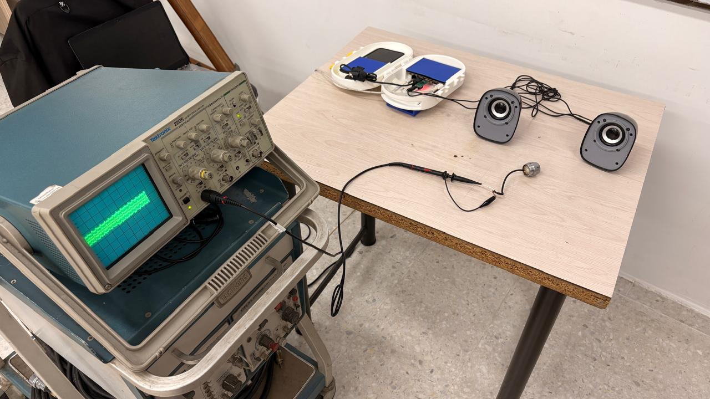
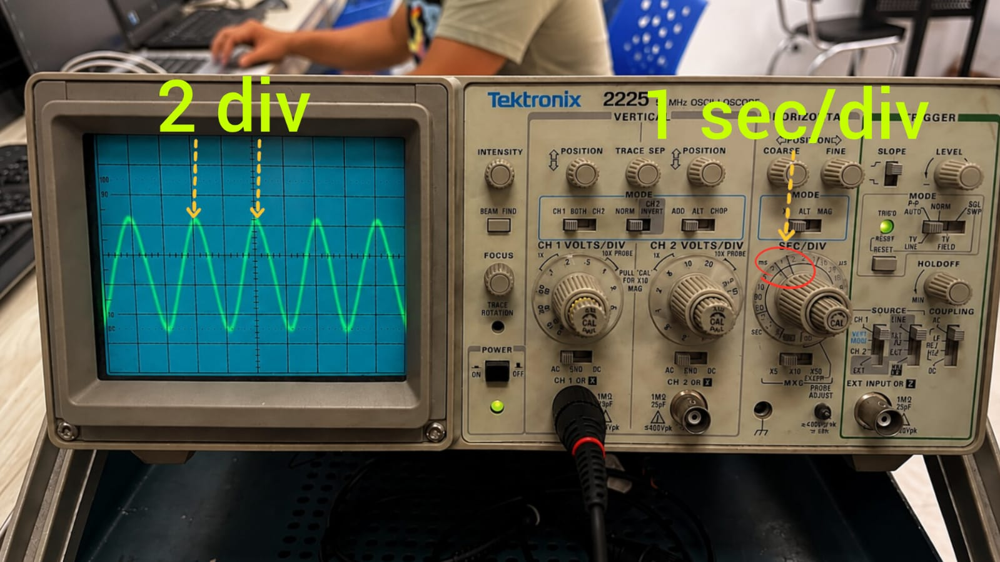
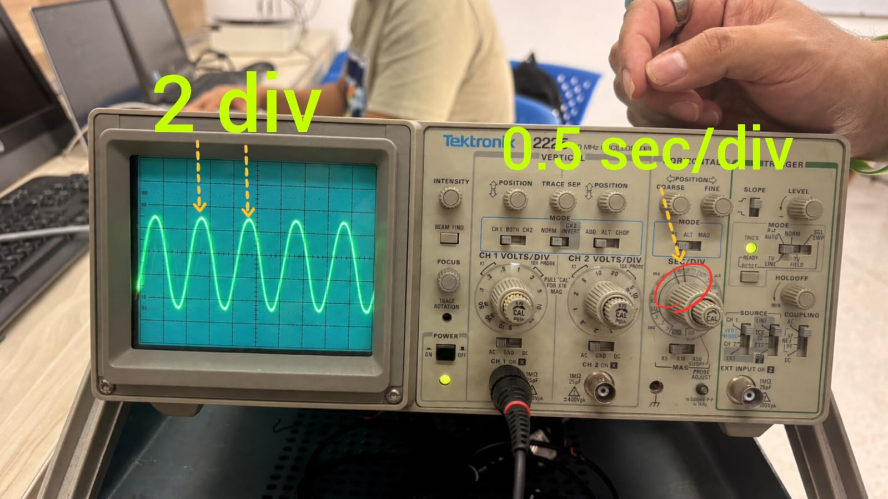
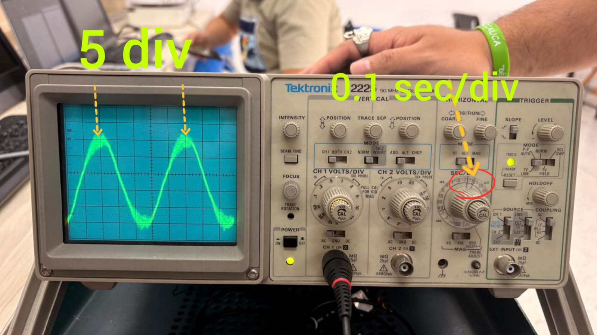
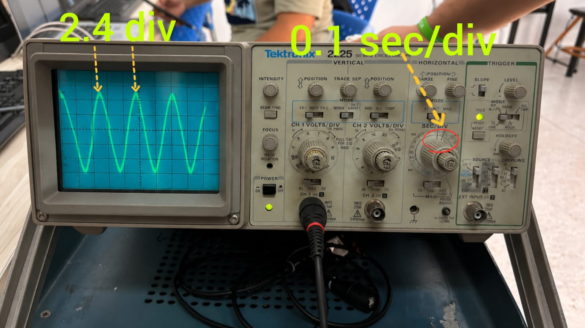

# ANEXO F. VALIDACIÓN DE EFECTIVIDAD TÉCNICA Y EVALUACIÓN DEL DISPOSITIVO

---

# F.1 Validación técnica del módulo de estímulo sonoro

## F.1.1 Objetivo de la prueba

La prueba tuvo como objetivo verificar el funcionamiento del módulo de estímulo sonoro mediante la comparación entre las frecuencias configuradas en el dispositivo y las frecuencias estimadas a partir de la señal reproducida por el sistema de audio.

Esta evaluación permitió comprobar la correspondencia entre los parámetros definidos durante la configuración del estímulo y la señal generada por el prototipo antes de su utilización en los ensayos experimentales.

La prueba corresponde a una verificación técnica del comportamiento del hardware dentro del contexto experimental del dispositivo. Sus resultados no representan una calibración audiológica clínica ni una medición certificada del nivel de presión sonora, sino una comprobación de consistencia de los estímulos generados.

---

# F.2 Instrumentación utilizada

Para la verificación de frecuencia se empleó un osciloscopio conectado a un sistema de captura de señal acústica. La señal generada por el parlante del dispositivo fue transformada en una señal eléctrica mediante un micrófono y posteriormente analizada en el dominio temporal.

Los instrumentos utilizados fueron:

| Instrumento | Marca / Modelo | Función |
|---|---|---|
| Micrófono | Transductor National / Matsushita (PANASONIC) | Captura de la señal acústica generada por el sistema de reproducción. |
| Osciloscopio | Tektronix 2225 50 MHz | Visualización de la señal y estimación del periodo de onda. |
| Parlante | Unitec U-P-420 | Elemento evaluado del módulo de estímulo sonoro. |

---

# F.3 Montaje experimental

La prueba se realizó utilizando la configuración habitual del módulo de estímulo sonoro implementado en el prototipo.

Las condiciones evaluadas fueron:

- Fuente de estímulo: módulo de reproducción sonora del dispositivo.
- Elemento de salida: parlantes Unitec U-P-420.
- Señales evaluadas: tonos sintéticos de 500 Hz, 1000 Hz, 2000 Hz y 4000 Hz.
- Método de análisis: medición del periodo de la señal observada en el osciloscopio.

La señal acústica emitida por el parlante fue capturada mediante el micrófono y representada en el osciloscopio para determinar la frecuencia aproximada generada.

**Figura F.1.** Montaje utilizado para la verificación técnica del módulo de estímulo sonoro.

---

# F.4 Procedimiento de medición

Para cada estímulo evaluado se siguió el siguiente procedimiento:

1. Configuración de la frecuencia nominal dentro del dispositivo.
2. Reproducción del estímulo tonal seleccionado.
3. Captura de la señal generada mediante el sistema de medición.
4. Identificación del periodo de la señal mediante la separación temporal entre picos consecutivos.
5. Cálculo de la frecuencia estimada utilizando:

\[
f=\frac{1}{T}
\]

donde:

- \(f\) corresponde a la frecuencia estimada en Hz.
- \(T\) corresponde al periodo medido en segundos.

El periodo fue obtenido mediante:

\[
T=número\ de\ divisiones \times escala\ temporal
\]

Finalmente, la frecuencia calculada fue comparada con la frecuencia configurada inicialmente en el dispositivo.
# F.5 Resultados de la validación técnica

## F.5.1 Verificación de frecuencia

La frecuencia generada por el módulo de estímulo sonoro fue estimada a partir del periodo observado en la señal capturada mediante el osciloscopio.

Los resultados obtenidos fueron:

| Estímulo | Frecuencia nominal (Hz) | Periodo medido (s) | Frecuencia calculada (Hz) | Diferencia (Hz) |
|---|---:|---:|---:|---:|
| Tono 500 Hz | 500 | 0.00212 | 471.7 | 28.3 |
| Tono 1000 Hz | 1000 | 0.00105 | 952 | 48 |
| Tono 2000 Hz | 2000 | 0.0005 | 2000 | 0 |
| Tono 4000 Hz | 4000 | 0.00024 | 4166.6 | 166.6 |

**Tabla F.1.** Comparación entre frecuencia configurada y frecuencia estimada mediante medición temporal.

Las diferencias observadas entre la frecuencia nominal y la calculada se encuentran asociadas principalmente al método de lectura empleado, considerando factores como:

- Resolución de la escala temporal del osciloscopio.
- Lectura manual del periodo de la señal.
- Variaciones propias del sistema de reproducción y captura.
- Condiciones del montaje experimental.

Los resultados permiten verificar que el módulo genera estímulos con frecuencias cercanas a las configuradas dentro del dispositivo, garantizando la consistencia del estímulo utilizado durante los ensayos experimentales.

---

# F.6 Evidencia fotográfica

**Figura F.2.** Señal capturada para el estímulo tonal de 500 Hz.

**Figura F.3.** Señal capturada para el estímulo tonal de 1000 Hz.

**Figura F.4.** Señal capturada para el estímulo tonal de 2000 Hz.

**Figura F.5.** Señal capturada para el estímulo tonal de 4000 Hz.

---

# F.7 Evaluación de pertinencia de la información generada por el dispositivo

## F.7.1 Objetivo de la evaluación

Con el propósito de analizar la utilidad percibida de la información presentada por la plataforma web, se realizó una valoración con profesionales en fonoaudiología vinculados al área de evaluación auditiva.

La evaluación estuvo orientada a conocer la percepción de los especialistas sobre la organización, claridad y utilidad de los elementos disponibles durante la revisión de los ensayos experimentales.

Esta valoración corresponde a una evaluación de pertinencia de la información generada por el prototipo y no representa una validación clínica del dispositivo ni una sustitución de procedimientos audiológicos especializados.

---

# F.7.2 Participantes

La evaluación fue realizada por cinco profesionales en fonoaudiología, quienes revisaron los elementos presentados por la plataforma y respondieron un instrumento estructurado.

Los aspectos evaluados fueron:

- Organización de la información del ensayo.
- Claridad del registro audiovisual.
- Interpretación de variables obtenidas mediante procesamiento computacional.
- Comprensión de la clasificación operacional generada por el modelo.
- Utilidad de la plataforma como herramienta de apoyo para la revisión.

---

# F.7.3 Instrumento aplicado

El instrumento utilizado estuvo compuesto por preguntas cerradas con escala tipo Likert de cinco niveles y preguntas abiertas de retroalimentación.

La escala utilizada fue:

| Valor | Interpretación |
|---|---|
| 1 | Totalmente en desacuerdo |
| 2 | En desacuerdo |
| 3 | Neutral |
| 4 | De acuerdo |
| 5 | Totalmente de acuerdo |

Las dimensiones evaluadas fueron:

| Dimensión | Aspectos analizados |
|---|---|
| Claridad de información | Organización del ensayo, estímulo aplicado, movimiento cefálico, indicadores faciales y clasificación computacional. |
| Utilidad de información | Registro audiovisual, variables extraídas, nivel de confianza y comparación entre ensayos. |
| Pertinencia profesional | Utilidad de la información como apoyo para la revisión del comportamiento observable. |

---

# F.7.4 Resultados generales de la valoración profesional

Los resultados detallados del instrumento aplicado se presentan en el Anexo G como parte de la evaluación de interacción y aceptación tecnológica.

De manera general, los profesionales destacaron como elementos relevantes:

- Disponibilidad del registro audiovisual asociado a cada ensayo.
- Relación entre estímulo aplicado, variables extraídas y clasificación operacional.
- Organización estructurada de la información experimental.
- Posibilidad de revisar los resultados generados por el modelo junto con la evidencia registrada.

Las observaciones obtenidas permitieron identificar oportunidades de mejora relacionadas con la explicación de algunas variables computacionales y la incorporación de información contextual adicional del ensayo.

---

# F.8 Conclusión del Anexo

La evaluación realizada permitió verificar dos aspectos principales del prototipo.

En primer lugar, la prueba técnica del módulo de estímulo sonoro evidenció que las señales generadas por el dispositivo presentan correspondencia con las frecuencias configuradas dentro del protocolo experimental.

En segundo lugar, la valoración realizada por profesionales permitió identificar que la información presentada mediante la plataforma posee características de organización, trazabilidad y utilidad como apoyo para la revisión de registros experimentales.

Estas evaluaciones corresponden a verificaciones técnicas y exploratorias del prototipo desarrollado, por lo cual sus resultados deben interpretarse dentro del alcance experimental definido para el dispositivo.
