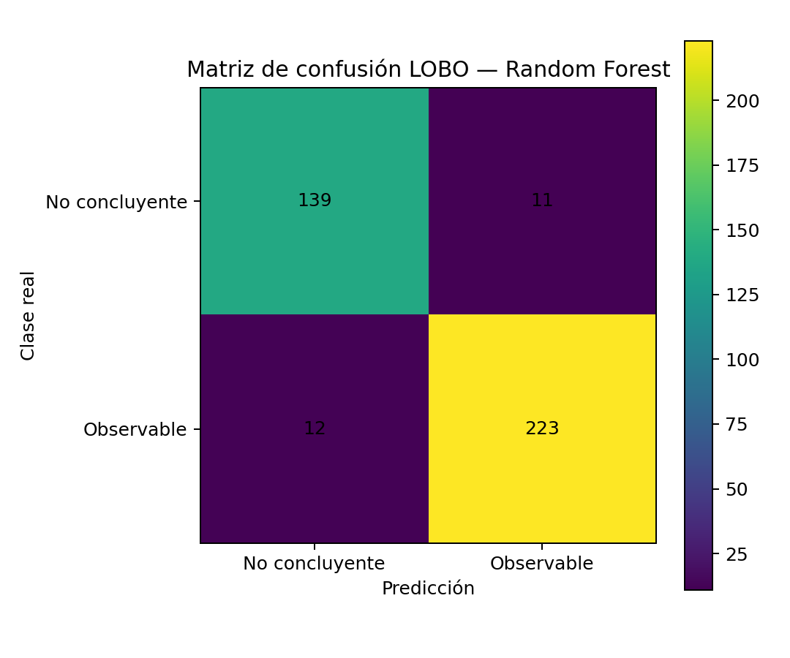
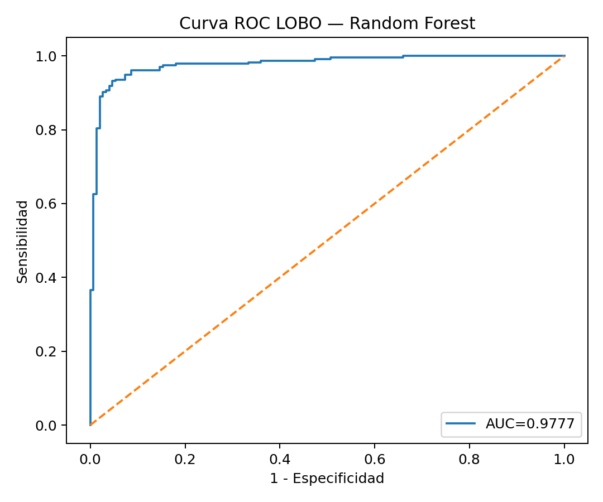
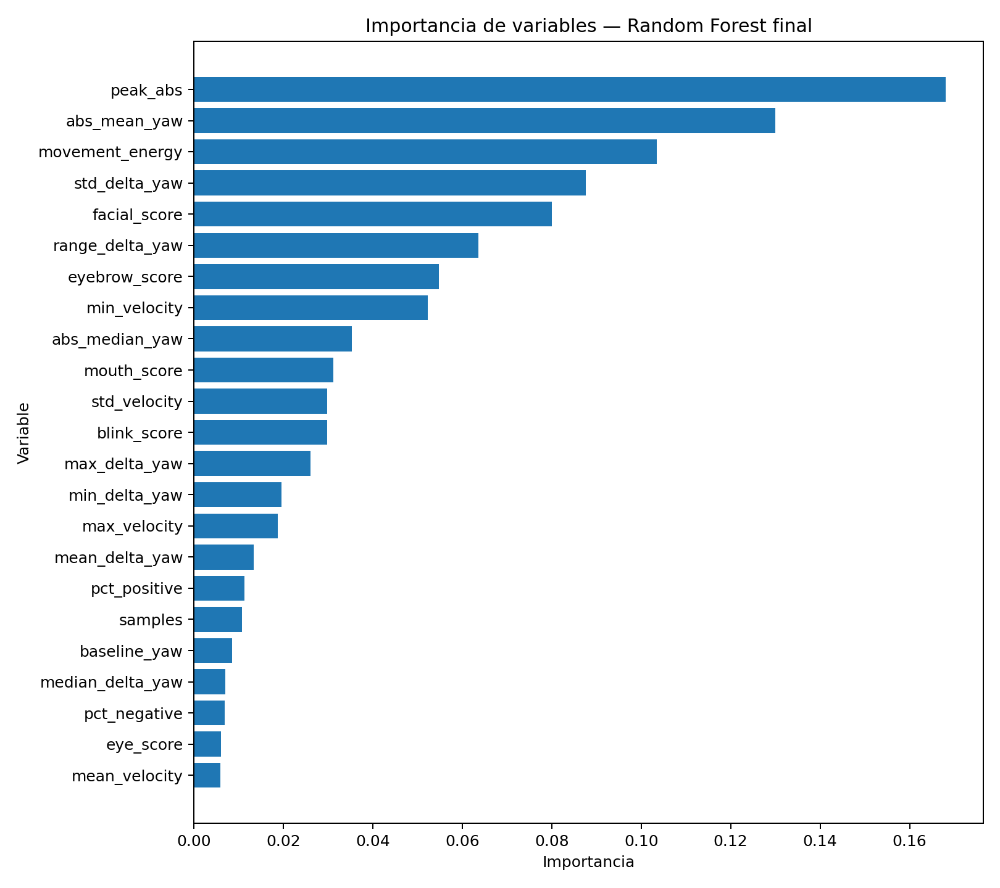

# ANEXO H. RESULTADOS DETALLADOS DEL MODELO DE CLASIFICACIÓN RANDOM FOREST

---

# H.1 Introducción

Este anexo presenta los resultados técnicos detallados del modelo de clasificación desarrollado mediante aprendizaje automático para identificar patrones asociados a respuestas conductuales observables frente a estímulos sonoros.

La información presentada complementa la evaluación descrita en el capítulo 5, incluyendo la configuración final del modelo, características del conjunto de datos utilizado, estrategia de validación, métricas de desempeño, matriz de confusión, curva ROC y análisis de importancia de variables.

El modelo desarrollado corresponde a una herramienta experimental orientada al apoyo del análisis de registros audiovisuales, por lo cual sus resultados no representan una validación diagnóstica independiente de la función auditiva.

---

# H.2 Configuración final del modelo

El modelo final fue desarrollado mediante un clasificador **Random Forest Classifier**, utilizando una configuración fija previamente seleccionada. No se realizó una nueva búsqueda de hiperparámetros durante el entrenamiento definitivo.

| Parámetro | Valor |
|---|---|
| Algoritmo | Random Forest Classifier |
| Número de árboles | 600 |
| Criterio de división | Gini |
| Profundidad máxima | 4 |
| Mínimo de muestras por hoja | 2 |
| Mínimo de muestras para división | 5 |
| Número de variables evaluadas por división | √n |
| Balance de clases | Activado |
| Semilla aleatoria | 42 |

---

# H.3 Características del conjunto de datos

El conjunto de datos utilizado para el entrenamiento y evaluación del modelo estuvo conformado por registros reales obtenidos durante las pruebas experimentales y registros simulados utilizados únicamente como apoyo durante la etapa de entrenamiento.

La distribución general del conjunto de datos fue:

| Característica | Cantidad |
|---|---:|
| Registros totales | 683 |
| Registros reales | 385 |
| Registros simulados | 298 |
| Participantes reales | 14 bebés |
| Variables utilizadas | 23 |

La distribución de clases fue:

| Clase | Registros reales | Registros simulados |
|---|---:|---:|
| Respuesta no concluyente | 150 | 175 |
| Respuesta conductual observable | 235 | 123 |

Los registros simulados no fueron utilizados como sustitutos de observaciones reales durante la evaluación del modelo. La validación se realizó exclusivamente sobre registros reales.

---

# H.4 Variables utilizadas por el modelo

El modelo utilizó 23 variables multimodales agrupadas en diferentes categorías relacionadas con movimiento cefálico, velocidad, magnitud del movimiento y características faciales.

## Movimiento cefálico

| Variable |
|---|
| baseline_yaw |
| mean_delta_yaw |
| median_delta_yaw |
| std_delta_yaw |
| min_delta_yaw |
| max_delta_yaw |
| range_delta_yaw |

## Velocidad del movimiento

| Variable |
|---|
| mean_velocity |
| std_velocity |
| max_velocity |
| min_velocity |

## Magnitud y distribución del movimiento

| Variable |
|---|
| peak_abs |
| pct_negative |
| pct_positive |
| abs_mean_yaw |
| abs_median_yaw |
| movement_energy |
| samples |

## Indicadores faciales

| Variable |
|---|
| facial_score |
| blink_score |
| eye_score |
| eyebrow_score |
| mouth_score |

La descripción completa de cada variable, incluyendo nombre, tipo, rango y significado, se presenta en el **Anexo E. Diccionario de variables**.

---

# H.5 Estrategia de validación del modelo

La evaluación del modelo se realizó mediante dos estrategias complementarias de validación:

- Validación cruzada estratificada agrupada de 5 particiones repetida dos veces.
- Validación Leave-One-Baby-Out (LOBO).

Ambas estrategias consideraron la dependencia existente entre registros pertenecientes a un mismo participante, utilizando separación agrupada mediante el identificador `baby_id`.

---

# H.5.1 Validación 5-fold agrupada repetida

Se aplicó una validación cruzada estratificada agrupada con:

- 5 particiones.
- 2 repeticiones.
- Separación por participante.

Durante cada iteración, los registros simulados únicamente fueron incorporados al conjunto de entrenamiento cuando sus registros reales de referencia pertenecían al grupo utilizado para entrenamiento.

La evaluación fue realizada sobre registros reales no utilizados durante el entrenamiento.

---

# H.5.2 Validación Leave-One-Baby-Out (LOBO)

La validación LOBO permitió evaluar la capacidad del modelo para generalizar hacia participantes no utilizados durante el entrenamiento.

En cada iteración, todos los registros correspondientes a un bebé fueron separados como conjunto de prueba, mientras que los demás participantes fueron utilizados para entrenamiento.

Esta estrategia permite estimar el comportamiento del modelo ante nuevos participantes.

---

# H.6 Resultados de validación 5-fold agrupada repetida

Los resultados promedio obtenidos durante la validación fueron:

| Métrica | Resultado |
|---|---:|
| Accuracy | 0.9377 |
| Balanced Accuracy | 0.9345 |
| F1 macro | 0.9345 |
| F1 clase observable | 0.9489 |
| Sensibilidad | 0.9489 |
| Especificidad | 0.9200 |
| MCC | 0.8690 |
| Cohen Kappa | 0.8689 |
| ROC-AUC | 0.9759 |

---

# H.7 Resultados de validación Leave-One-Baby-Out

Los resultados obtenidos mediante validación LOBO fueron:

| Métrica | Resultado |
|---|---:|
| Accuracy | 0.9403 |
| Balanced Accuracy | 0.9378 |
| F1 macro | 0.9373 |
| Sensibilidad | 0.9489 |
| Especificidad | 0.9267 |
| MCC | 0.8746 |
| Cohen Kappa | 0.8745 |
| ROC-AUC | 0.9777 |

---

# H.8 Matriz de confusión LOBO

La matriz de confusión obtenida durante la validación LOBO fue:

Los resultados obtenidos fueron:

| | Predicción no concluyente | Predicción observable |
|---|---:|---:|
| Real no concluyente | 139 | 11 |
| Real observable | 12 | 223 |

La matriz muestra que el modelo clasificó correctamente la mayoría de los registros evaluados, presentando 11 falsos positivos y 12 falsos negativos sobre los datos reales utilizados durante la validación.

---

# H.9 Curva ROC

La curva ROC obtenida durante la validación LOBO presentó un área bajo la curva:

**AUC = 0.9777**

Este resultado indica una alta capacidad de separación entre las categorías definidas dentro del conjunto experimental evaluado.

---

# H.10 Importancia de variables

La importancia de variables obtenida mediante Random Forest permitió identificar cuáles características tuvieron mayor contribución dentro del proceso de clasificación.

Las variables con mayor importancia fueron:

| Variable | Importancia |
|---|---:|
| peak_abs | 0.1681 |
| abs_mean_yaw | 0.1299 |
| movement_energy | 0.1034 |
| std_delta_yaw | 0.0877 |
| facial_score | 0.0800 |
| range_delta_yaw | 0.0636 |
| eyebrow_score | 0.0548 |
| min_velocity | 0.0523 |
| abs_median_yaw | 0.0353 |
| mouth_score | 0.0311 |

Las variables con mayor contribución corresponden principalmente a características relacionadas con magnitud del movimiento cefálico, variabilidad del desplazamiento y cambios faciales observables.

---

# H.11 Consideraciones metodológicas del modelo

El modelo desarrollado debe interpretarse dentro del alcance experimental definido para el proyecto.

Aunque los resultados muestran un desempeño favorable sobre el conjunto evaluado, la clasificación generada corresponde a una categorización operacional de respuestas conductuales observables y no constituye un diagnóstico independiente de la función auditiva.

La separación por participante durante las estrategias de validación permitió reducir el riesgo de sobreestimación del desempeño causada por registros relacionados pertenecientes al mismo bebé.

Por tanto, el modelo debe entenderse como una herramienta computacional complementaria para organizar y analizar información audiovisual, manteniendo la interpretación final bajo criterio profesional.

---

# H.12 Conclusión del análisis computacional

Los resultados obtenidos evidencian la capacidad del modelo Random Forest para identificar patrones asociados a respuestas conductuales observables dentro del conjunto experimental utilizado.

La combinación de variables de movimiento cefálico e indicadores faciales permitió construir una representación multimodal del comportamiento registrado durante los ensayos.

Sin embargo, debido al carácter exploratorio del estudio y al tamaño de muestra disponible, estos resultados deben considerarse como una validación inicial del desempeño computacional del prototipo y no como una validación clínica del funcionamiento auditivo.
